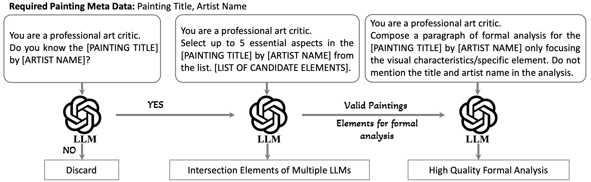

# GalleryGPT

This repository contains the code, data and model for the paper titled "GalleryGPT: Analyzing Paintings with Large Multimodal Models".

## Latest News 🔥
* [2024-7-18] We released [code](https://github.com/steven640pixel/GalleryGPT), [PaintingForm dataset](https://huggingface.co/datasets/steven16/Painting-Form/tree/main) and [GalleryGPT LoRA checkpoint](https://drive.google.com/drive/folders/1qLbnxxBwZ15ejaHES_LRCi2Fahv3Od5G?usp=drive_link).
* [2024-7-16] The paper has been accepted by ACM MM 2024 (**Oral, Top 3.97%**). $${\color{red}{Oral, Top 3.97%}}$$


## Install Packages
```
cd GalleryGPT
conda create -n gallery_gpt python=3.10 -y
conda activate gallery_gpt
pip install -e .
pip install protobuf
```
## Enable Deepspeed and Flash-attention
```
pip install -e ".[train]"
pip install flash-attn --no-build-isolation
```

## Data Preparation
Download [PaintingForm dataset](https://huggingface.co/datasets/steven16/Painting-Form/tree/main). "train_samples_tuning.json" corresponds to the annotations of painting formal analysis for instruction finetuning. 

The overall pipeline of constructing our PaintingForm:
<div align=center>

</div>


Place the data in the root or other directory.
Data structure:
```
├── art_images_data/
│   ├── images/0.png
│   ├── images/1.png
│   ├── ...
├── train_samples_tuning.json
```

## Run LoRA-finetuning
Download [ShareGPT4V-7B](https://huggingface.co/Lin-Chen/ShareGPT4V-7B/tree/main) as base model and place in ./share4v/llava-7b, then replace config.json with ours in root directory. 
Run script:
```
sh finetune_task_lora.sh
```

## Checkpoints and Inference
You can download [base model](https://huggingface.co/Lin-Chen/ShareGPT4V-7B/tree/main) then replace config.json with ours in root directory, and [LoRA checkpoint](https://drive.google.com/drive/folders/1qLbnxxBwZ15ejaHES_LRCi2Fahv3Od5G?usp=drive_link). For inference:
```
cd llava/eval
python run_llava.py --model-path llava-lora-model --model-base share4v/llava-7b --image-file your/image/path --query  
```

## Acknowledgement
The project is built on top of the amazing [LLaVA](https://github.com/haotian-liu/LLaVA) repository and [ShareGPT4V](https://github.com/ShareGPT4Omni/ShareGPT4V) repository. Thanks for their contributions.


If you find our work helpful to your research, please consider citing us with this BibTeX:
```bibtex
@inproceedings{MM24GalleryGPT,
  author    = {Yi Bin and
               Wenhao Shi and
               Yujuan Ding and
               Zhiqiang Hu and
               Zheng Wang and
               Yang Yang and
               See-Kiong Ng and
               Heng Tao Shen}
  title     = {GalleryGPT: Analyzing Paintings with Large Multimodal Models},
  booktitle = {Proceedings of the 32th ACM International Conference on Multimedia, 28 October – 1 November, 2024, Melbourne, Australia.},
  year      = {2024},
}
```
